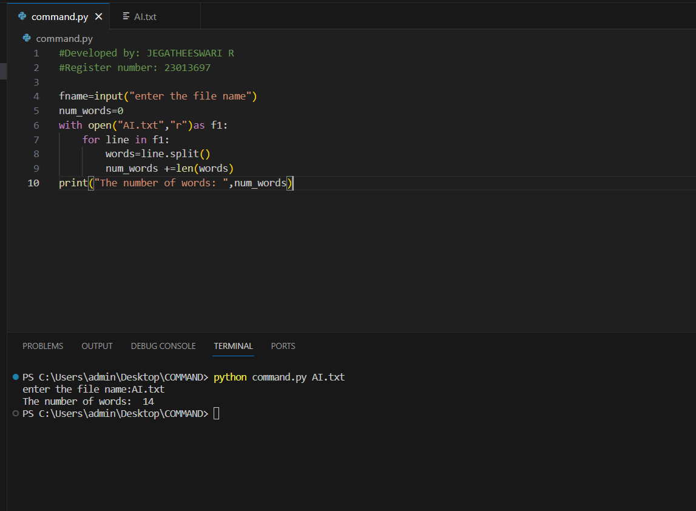
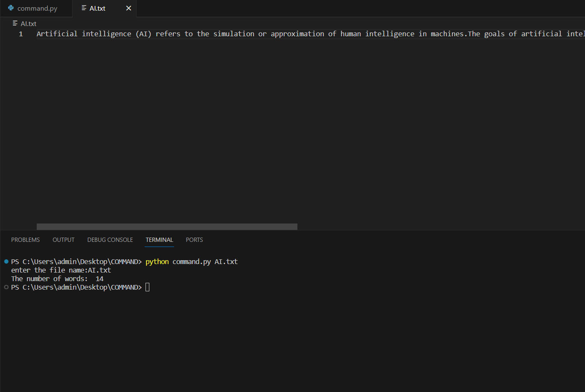

# command-line-arguments-to-count-word
## AIM:
To write a python program for getting the word count from the contents of a file using command line arguments.
## EQUIPEMENT'S REQUIRED: 
PC
Anaconda - Python 3.7
## ALGORITHM: 
### Step 1:
import sys


### Step 2: 
Open file using open().

 
### Step 3: 
Use for loop


### Step 4:  
Use len to count number of words.


### Step 5: 
Give print.


## PROGRAM:
```
'''
#Developed by: JEGATHEESWARI R
#Register number: 23013697
'''
fname=input("enter the file name")
num_words=0
with open("AI.txt","r")as f1:
    for line in f1:
        words=line.split()
        num_words +=len(words)
print("The number of words: ",num_words)

```


### OUTPUT:




## RESULT:
Thus the program is written to find the word count from the contents of a file using command line arguments.
